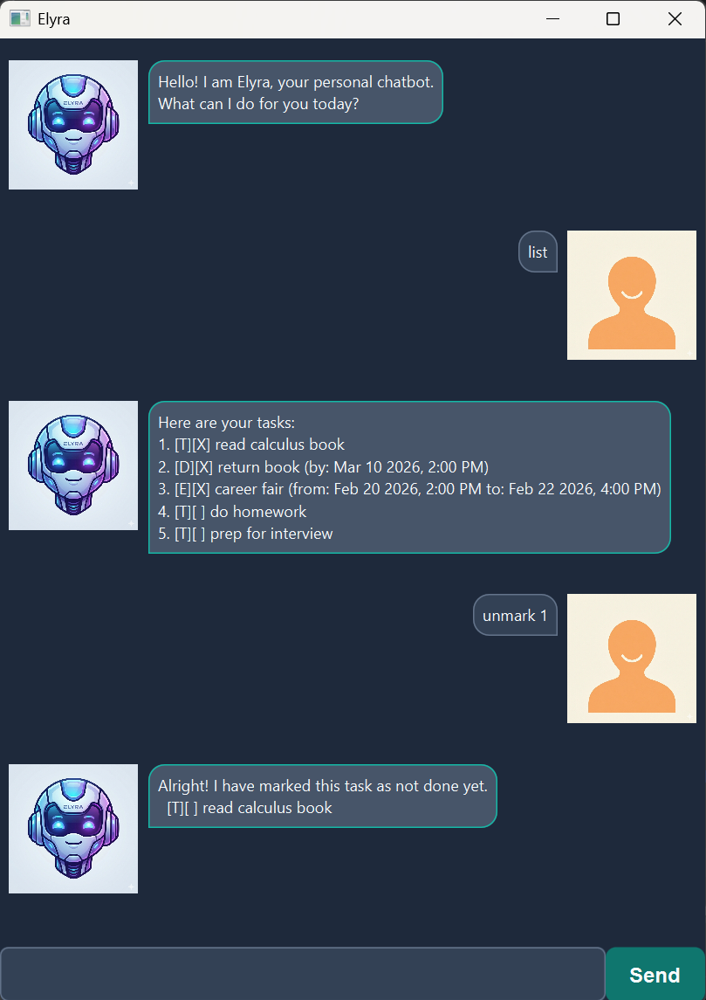

# 🤖 Elyra User Guide

Elyra is a desktop task manager chatbot that lets you track todos, deadlines, and events using short commands in a chat-style UI.

---

## 📖 Table of Contents
* [Quick Start](#quick-start)
* [General Usage Notes](#general-usage-notes)
* [Commands: Adding Tasks](#adding-tasks)
* [Commands: Managing Tasks](#managing-tasks)
* [Data Storage](#data-storage)
* [Command Summary](#command-summary)

---

## ⚡ Quick Start

1. **Install Java:** Ensure you have **JDK 17** installed.
2. **Run the App:**
    * If you have `Elyra.jar`: `java -jar Elyra.jar`
    * From project root: `.\gradlew run` (Win) or `./gradlew run` (Mac/Linux)
3. **Chat:** Type a command into the input box and press **Enter**.

---

## 📝 Notes on Command Format

* **Case Sensitivity:** Commands are case-insensitive (`LIST`, `List`, and `list` all work).
* **Parameters:** Words in `UPPER_CASE` are user-defined inputs.
* **Dates:** Must be in `yyyy-MM-dd HH:mm` format (e.g., `2026-02-15 23:59`).
* **Task Indicators:** * `[T]` Todo | `[D]` Deadline | `[E]` Event
    * `[X]` Task is marked as done.

---

## ✨ Features

### `todo`: Add a simple task
Adds a task without any date or time constraints.
> **Format:** `todo DESCRIPTION`  
> **Example:** `todo read CS2103 notes`

### `deadline`: Add a time-sensitive task
Adds a task that must be completed by a specific deadline.
> **Format:** `deadline DESCRIPTION /by yyyy-MM-dd HH:mm`  
> **Example:** `deadline iP submission /by 2026-02-15 23:59`

### `event`: Add a scheduled task
Adds a task with a specific start and end time.
> **Format:** `event DESCRIPTION /from yyyy-MM-dd HH:mm /to yyyy-MM-dd HH:mm`  
> **Example:** `event project meeting /from 2026-02-20 14:00 /to 2026-02-20 15:30`

### `list`: View all tasks
Displays your current list of tasks with their status icons and indexes.
> **Format:** `list`

### `mark` / `unmark`: Toggle completion
Update the status of a task using its index from the `list` command.
> **Format:** `mark INDEX` or `unmark INDEX`  
> **Example:** `mark 2`

### `update`: Edit an existing task
Modify specific fields of a task without deleting it.
> **Format:** `update INDEX /field FIELD /with VALUE`  
> **Valid Fields:** `description` (for all tasks), `by` (for deadlines only), `from`/`to` (for events only).  
> **Example:** `update 1 /field description /with revise lecture 3`, `update 2 /field by /with 2026-02-16 18:00`, `update 3 /field from /with 2026-02-20 13:30`

### `delete`: Remove a task
Permanently removes a task from your list.
> **Format:** `delete INDEX`  
> **Example:** `delete 3`

### `find`: Search tasks
Finds tasks whose descriptions contain the keyword (case-insensitive).
> **Format:** `find KEYWORD`  
> **Example:** `find tutorial`

### `bye`: Exit the app
Closes the Elyra application.
> **Format:** `bye`

---

## 💾 Data Storage

* **Auto-save:** Your tasks are saved automatically after any command that changes data.
* **File Location:** The data file is stored at `data/elyra.txt` relative to the app folder.
* **Corruption:** If the file is corrupted, Elyra starts with an empty list. You can always exit Elyra to manually to fix formatting issues to preserve your data.

---

## 📋 Command Summary

| Action | Format | Example |
| :--- | :--- | :--- |
| **Add Todo** | `todo DESCRIPTION` | `todo buy milk` |
| **Add Deadline** | `deadline DESC /by TIME` | `deadline return book /by 2026-02-15 18:00` |
| **Add Event** | `event DESC /from T1 /to T2` | `event concert /from 2026-03-01 19:00 /to 22:00` |
| **List** | `list` | `list` |
| **Mark** | `mark INDEX` | `mark 1` |
| **Unmark** | `unmark INDEX` | `unmark 1` |
| **Delete** | `delete INDEX` | `delete 1` |
| **Update** | `update INDEX /field F /with V` | `update 1 /field description /with sleep` |
| **Find** | `find KEYWORD` | `find tutorial` |
| **Exit** | `bye` | `bye` |